# Mecânica DM - API de Gestão para Oficinas

[](https://sonarcloud.io/project/overview?id=mecanica-dm_mecanicadm-api-v3)


API RESTful para o sistema **Mecânica DM**, uma solução completa para gerenciamento de ordens de serviço, clientes, estoque e fluxo de trabalho em oficinas mecânicas.

Na **Fase 03** do 15SOAT, temos o objetivo de melhorar a estrutura separando o projeto em diversos repositórios, implementar monitoramento/observabilidade, e melhorar a infraestrutura do projeto.

---

## 📚 Documentação Externa e Modelagem

- **[Storytelling (Egon.io)](https://github.com/user-attachments/assets/fd2adfad-1fa9-469d-958a-1cf902666b36)**: Storytelling inicial do fluxo de funcionamento da mecânica.
- **[Dicionário de Dados (Notion)](https://lopsided-hourglass-4f8.notion.site/Dicion-rio-de-dados-32f0a8ca8e738075ae44c9ec0b5180b3?source=copy_link)**: Visão detalhada das entidades e relacionamentos do banco de dados.
- **[Event Storming (Miro)](https://miro.com/app/board/uXjVIT7cD_4=/?share_link_id=217316260154)**: Mapeamento de domínio e comportamento orientado a eventos do sistema.
- **[Dashboard do SonarCloud](https://sonarcloud.io/project/overview?id=mecanica-dm_mecanicadm-api-v3)**: Análise contínua de qualidade de código, vulnerabilidades e cobertura de testes.

### Componenetes de infraestrutura

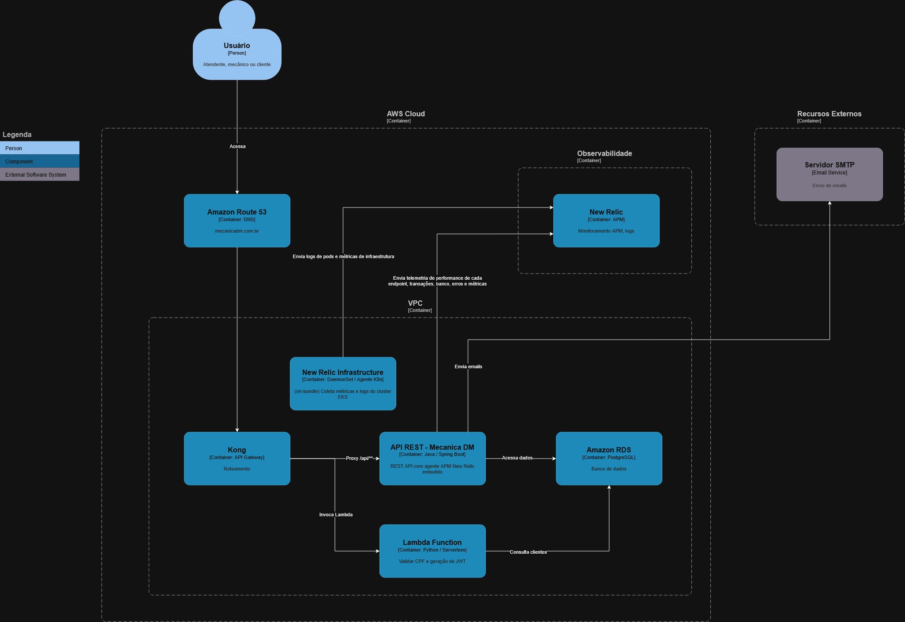

### Componentes da aplicação


### Fluxo de deploy

[Link para imagem do fluxo](docs/assets/fluxo-deploy-fase-03.png)

<div align="center">

```mermaid
flowchart LR
    TRIGGER[Disparo do Workflow] --> COND{Evento}
    COND -->|push| M1[Branch: main]
    COND -->|pull_request| PR[Pipeline PR]
    COND -->|workflow_dispatch| WD[Manual]

    M1 --> BUILD
    PR --> BUILD
    WD --> BUILD

    subgraph BUILD[build-and-test]
        direction LR
        A1[Checkout]
        A2[Setup JDK 21]
        A3[Build e Testes]
        A4[Análise Sonar]
        A1 --> A2 --> A3 --> A4
    end

    subgraph SEC[security-scan]
        direction LR
        S1[Checkout]
        S2[Subir aplicação]
        S3[ZAP Scan OpenAPI]
        S4[Upload Relatório]
        S5[Parar containers]
        S1 --> S2 --> S3 --> S4 --> S5
    end

    BUILD -->|sucesso| SEC

    subgraph PUB[publish-and-deploy]
        direction LR
        P1[Login Docker Hub]
        P2[Build e push imagem]
        P3[Disparar deploy K8s]
        P1 --> P2 --> P3
    end

    SEC -->|sucesso| GATE{Em main?}
    GATE -->|sim| PUB
    GATE -->|não| FIM1[Fim - sem deploy]
    PUB --> FIM2[Deploy no K8s]
```

</div>

* build-and-test: Responsável por fazer o maven build e executar os testes da aplicação
* security-scan: Rodamos o ZAP Scan para verificar problemas de segurança
* publish-and-deploy: Aqui fazemos o build da imagem docker e publicamos para o Docker Hub, além disso fazemos um trigger para rodar a próxima pipe do repositório de k8s

### Diagrama de Entidade-Relacionamento

[Link para imagem do diagrama](docs/assets/erd-mecanicadm.png)


### Diagramas de sequência

#### Fluxo de OS

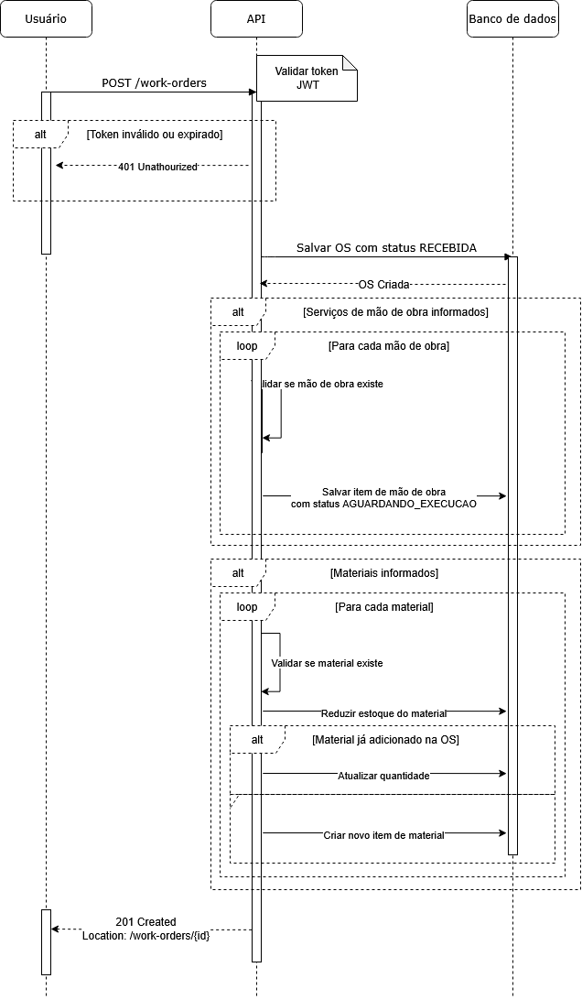

#### Fluxo de Autenticação


---

## ✨ Funcionalidades Principais

- **🔩 Gestão de Ordens de Serviço**: Ciclo de vida completo, desde a criação, diagnóstico, execução até a entrega.
- **💰 Geração e Controle de Orçamentos**: Criação detalhada de orçamentos vinculados às O.S., controle de status de aprovação pelo cliente e gestão de custos de peças e mão de obra.
- **🖨️ Impressão de Orçamento**: Geração de relatórios de orçamento em formato PDF, retornados via API como string Base64 para facilitar o tráfego e a integração.
- **👤 Gestão de Clientes e Veículos**: Cadastro e consulta de clientes e veículos.
- **📦 Controle de Estoque**: Gerenciamento de materiais, com dedução automática de estoque ao adicionar em uma O.S.
- **🛠️ Catálogo de Serviços (Mão de Obra)**: Cadastro dos serviços prestados pela oficina.
- **🔐 Autenticação e Autorização**: Segurança baseada em JWT e criptografia de credenciais.
- **📊 Analytics**: Endpoints para extração de métricas e relatórios de performance.
- **🌐 Suporte a Múltiplos Idiomas**: Mensagens de erro e validação em Português, Inglês e Espanhol.

### 🖨️ Testando a Impressão de Orçamento (Base64 -> PDF)

A rota de impressão de orçamentos retorna o arquivo PDF codificado em uma string **Base64**. Para visualizar o arquivo gerado durante os seus testes no Swagger ou Postman:

1. Copie a string Base64 retornada no corpo da resposta (`response body`).
2. Acesse uma ferramenta confiável de conversão online, como:
    - **[Base64.guru - Decode Base64 to PDF](https://base64.guru/converter/decode/pdf)**
3. Cole a string copiada no campo principal do site e clique em "Decode". A visualização do arquivo PDF começará imediatamente.

---

## 🚀 Tecnologias Utilizadas

| Categoria        | Tecnologia                                            |
|------------------|-------------------------------------------------------|
| **Core**         | Java 21, Spring Boot 3                                |
| **Dados**        | Spring Data JPA, PostgreSQL, Flyway (Migrations)      |
| **Segurança**    | Spring Security, JWT (Java JWT)                       |
| **Documentação** | Springdoc (Swagger/OpenAPI 3)                         |
| **Testes**       | JUnit 5, Mockito, REST Assured, Testcontainers (PostgreSQL) |
| **Build**        | Maven                                                 |
| **Container**    | Docker, Docker Compose                                |

> ‼️ O banco utilizado foi PostgreSQL, a justificativa formal para o uso desse banco se encontra na **RFC 002 - Escolha do Banco de Dados** que pode ser acessada na seção RFCs.

---

## 🏛️ Arquitetura e Decisões

O projeto segue uma arquitetura em camadas, inspirada em princípios de _Clean Architecture_ e _Domain-Driven Design (DDD)_, para garantir separação de responsabilidades, testabilidade e manutenibilidade. Além disso, as diretrizes de código são guiadas por **Architecture Decision Records (ADRs)** armazenadas no projeto.

- `domain`: Contém as entidades, agregados e regras de negócio principais.
- `usecase`: Orquestra o fluxo de operações, implementando os casos de uso através de `Commands` e `Queries`.
- `adapter`: Conecta o núcleo da aplicação com o mundo exterior (Controllers, Repositories).
- `service`: Implementações concretas dos casos de uso isolados.
- `infra`: Configurações de infraestrutura, segurança, tratamento global de exceções e configurações de banco de dados.

### 📝 ADRs (`docs/adr/`):

- **[ADR 001 - Nomenclatura de Consultas](docs/adr/001-nomenclatura_consultas.md)**
- ~~**[ADR 002 - Padrão UseCases e Commands](docs/adr/002-padrao_usecases_commands.md)**~~ 💤 Substituída por ADR 011
- **[ADR 003 - Lógica de Negócio no Domínio](docs/adr/003-logica_negocio_dominio.md)**
- **[ADR 004 - Padrão de Exceções Modulares](docs/adr/004-padrao_excecoes_modulares.md)**
- ~~**[ADR 005 - Estratégia de Soft Delete e Auditoria](docs/adr/005-estrategia_soft_delete_auditoria.md)**~~ 💤 Substituída por ADR 011
- **[ADR 006 - Contrato de Exceções de Domínio e i18n](docs/adr/006-contrato_excecoes_dominio_i18n.md)**
- **[ADR 007 - Pirâmide e Tipos de Testes](docs/adr/007-piramide_tipos_testes.md)**
- **[ADR 008 - Padrões de Testes de Integração](docs/adr/008-padroes_testes_integracao.md)**
- **[ADR 009 - Nomenclatura e Documentação de Testes](docs/adr/009-nomenclatura_documentacao_testes.md)**
- **[ADR 010 - Estratégia de i18n e Múltiplos Idiomas](docs/adr/010-estrategia_i18n_multi_idioma.md)**
- **[ADR 011 - Arquitetura Limpa Purista para Novas Features 🆕](docs/adr/011-arquitetura-limpa-purista-novas-features.md)**

### 📝 RFCs (`docs/rfc/`):

- **[RFC 001 - Escolha de nuvem](docs/rfc/001-escolha_de_nuvem.md)**
- **[RFC 002 - Escolha de banco de dados](docs/rfc/002-escolha_banco_de_dados.md)**

---

## 👓 Observalibidade

A observabilidade da aplicação é feita através do **[New Relic](https://one.newrelic.com/nr1-core?account=8485340&filters=%28domain%20IN%20%28%27APM%27%2C%20%27EBPF%27%2C%20%27EXT%27%29%20AND%20type%20IN%20%28%27APPLICATION%27%2C%20%27SERVICE%27%2C%20%27SERVICE%27%29%29&state=ef9bcc8a-77d2-eeac-5561-2ee522dd417c)**. O agente Java (`newrelic.jar`) é injetado no container via `-javaagent` (ver `Dockerfile`) e coleta métricas, traces distribuídos (APM) e instrumenta automaticamente Spring, JDBC e servlets. Os logs em JSON são enviados via integração Logback/New Relic (`logback-spring.xml`).

Para habilitar o envio dos dados, configure a variável de ambiente **`NEW_RELIC_LICENSE_KEY`** com a chave de licença da sua conta.

- Overview:
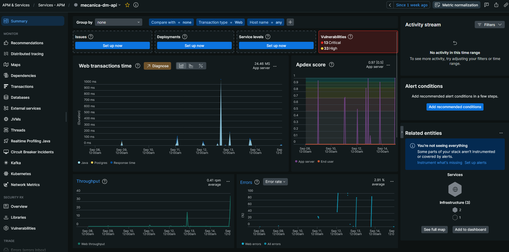
- Latência das APIs: 
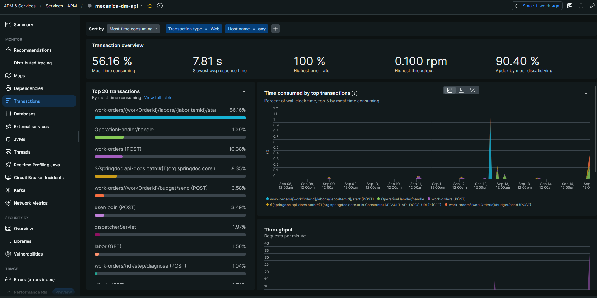
- CPU e Memória:
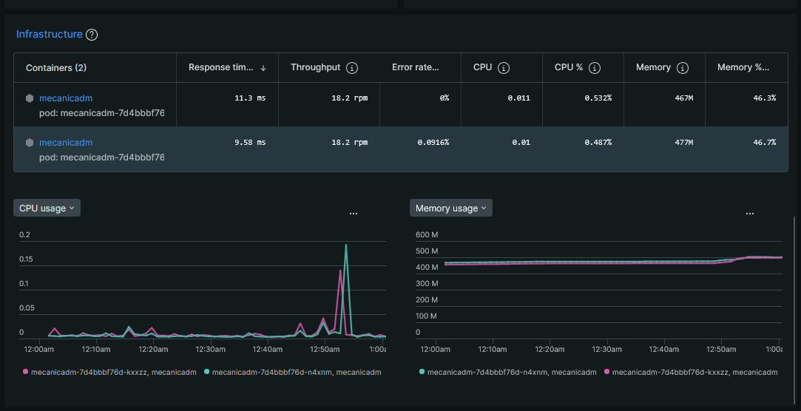
- Logs estruturados:
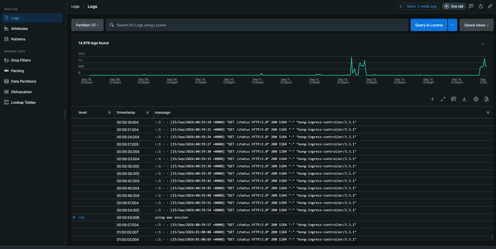
- Traces:
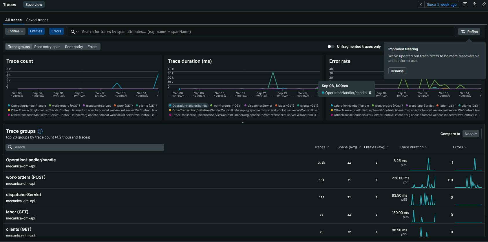
- Alerta de erro:
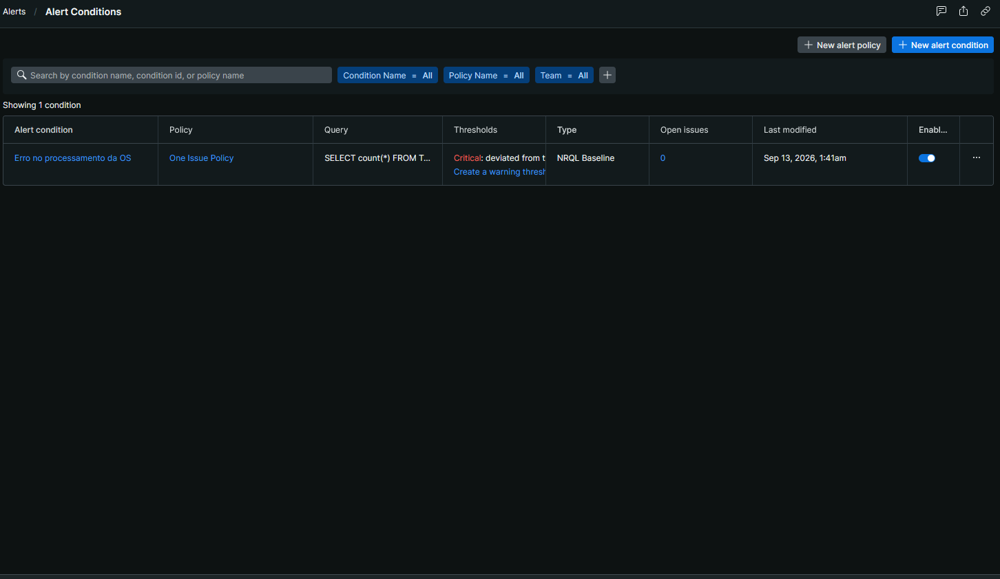
- Dashboard (Volume diário de OS, tempo médio de execução, Uptime, Erros da aplicação e mais!):
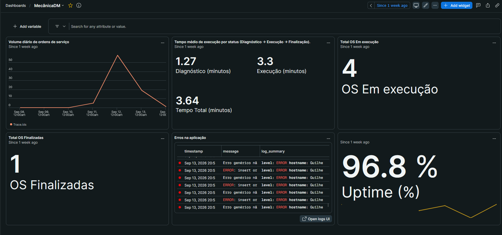
- Healthcheck:
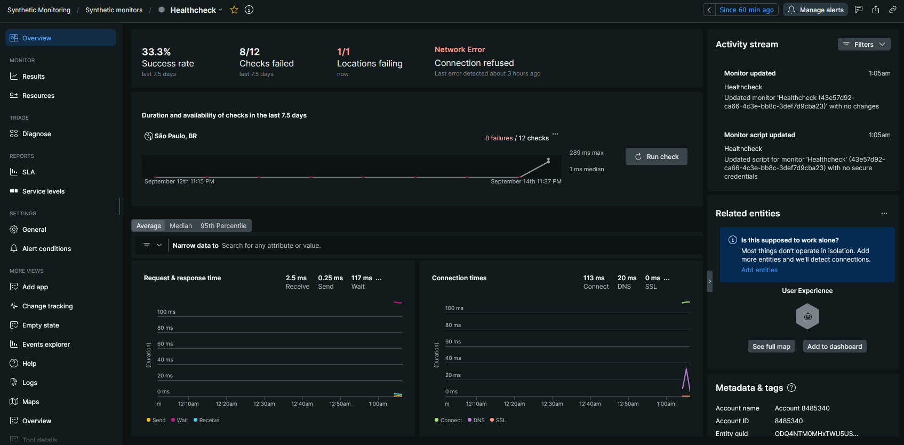

---

## 🏁 Como Começar

### Pré-requisitos

- [Docker](https://www.docker.com/get-started) e [Docker Compose](https://docs.docker.com/compose/install/)
- [Kubectl](https://kubernetes.io/pt-br/docs/tasks/tools/)

### Execução local com docker compose

1. **Crie o arquivo `.env`**: na raiz do projeto, copie o exemplo para `.env` e ajuste as variáveis (credenciais do banco, e-mail, etc.) conforme necessário:

   ```bash
   cp .env.example .env
   ```

2. **Suba o ambiente**: ainda na raiz do projeto, execute:

   ```bash
   docker compose up -d --build
   ```

   Esse comando irá:
   - Iniciar o container do PostgreSQL.
   - Construir a imagem da API e iniciá-la, conectando-a ao banco.
   - Executar as migrações do Flyway.
   - Executar o `seeder`, que popula o banco com dados iniciais.

3. **Aguarde os containers ficarem saudáveis**:

   ```bash
   docker compose ps
   ```

4. **Acesse a aplicação**: a API estará disponível em `http://localhost:8080`

5. **Autentique-se** com as credenciais iniciais para explorar os endpoints (veja a seção [Credenciais de Acesso Iniciais](#-credenciais-de-acesso-iniciais)).

6. **Para parar o ambiente**, execute:

   ```bash
   docker compose down
   ```

   > 💡 Para parar e remover também o volume do banco (apagando os dados), use `docker compose down -v`.

---

## 📄 Documentação da API

Com a API em execução, a documentação interativa do Swagger UI fica disponível em:

**Local:** `http://localhost:8080/api/swagger-ui/index.html`

**Produção:** `http://api.mecanicadm.com.br/api/swagger-ui/index.html`

A especificação OpenAPI 3 pode ser acessada em `/v3/api-docs`.

### 🔑 Credenciais de Acesso Iniciais

- **Email**: `admin@mecanicadm.com`
- **Senha**: `Senha123`

### Principais Endpoints

A lista completa de endpoints pode ser consultada no Swagger UI (`/api/swagger-ui/index.html`). Abaixo estão os principais endpoints da aplicação.

#### 🔐 Autenticação e Usuários

| Método | Endpoint | Descrição |
|--------|----------|-----------|
| POST   | `/user/login` | Autentica o usuário e retorna o token JWT |
| POST   | `/user/forgot-password` | Solicita a recuperação de senha |
| POST   | `/user/reset-password` | Confirma a redefinição de senha via token |
| GET    | `/user/{id}` | Busca um usuário pelo ID |
| POST   | `/user` | Cria um novo usuário |
| PUT    | `/user` | Atualiza o usuário autenticado |
| DELETE | `/user` | Remove (soft delete) o usuário autenticado |

#### 👤 Clientes

| Método | Endpoint | Descrição |
|--------|----------|-----------|
| POST   | `/clients` | Cria um novo cliente |
| GET    | `/clients` | Lista clientes com filtros (`name`, `document`) e paginação |
| PUT    | `/clients/{id}` | Atualiza um cliente |
| DELETE | `/clients/{id}` | Remove (soft delete) um cliente |

#### 🚗 Veículos

| Método | Endpoint | Descrição |
|--------|----------|-----------|
| POST   | `/vehicle` | Cria um novo veículo |
| GET    | `/vehicle` | Lista veículos com filtros (`licensePlate`, `model`, `brand`, `modelYear`) e paginação |
| GET    | `/vehicle/{licensePlate}` | Busca um veículo pela placa |
| PUT    | `/vehicle/{licensePlate}` | Atualiza um veículo |
| DELETE | `/vehicle/{licensePlate}` | Remove um veículo |

#### 🛠️ Mão de Obra (Serviços)

| Método | Endpoint | Descrição |
|--------|----------|-----------|
| POST   | `/labor` | Cria um novo serviço/mão de obra |
| GET    | `/labor` | Lista serviços com filtro (`name`) e paginação |
| GET    | `/labor/{id}` | Busca um serviço pelo ID |
| PUT    | `/labor/{id}` | Atualiza um serviço |
| DELETE | `/labor/{id}` | Remove um serviço |

#### 📦 Materiais e Estoque

| Método | Endpoint | Descrição |
|--------|----------|-----------|
| POST   | `/materials` | Cria um novo material |
| GET    | `/materials` | Lista materiais com filtros (`name`, `brand`, `type`) e paginação |
| GET    | `/materials/{id}` | Busca um material pelo ID |
| PUT    | `/materials/{id}` | Atualiza um material |
| DELETE | `/materials/{id}` | Remove (soft delete) um material |
| GET    | `/stock-movements/{materialId}/statement` | Extrato de movimentações de estoque de um material |

#### 🔩 Ordens de Serviço

| Método | Endpoint | Descrição |
|--------|----------|-----------|
| POST   | `/work-orders` | Cria uma nova ordem de serviço |
| GET    | `/work-orders` | Lista O.S. com filtros (`clientId`, `licensePlate`) e paginação |
| GET    | `/work-orders/{id}` | Busca uma O.S. pelo ID |
| GET    | `/work-orders/{id}/status` | Consulta o status atual da O.S. |
| PUT    | `/work-orders/{id}` | Atualiza uma O.S. |
| DELETE | `/work-orders/{id}` | Remove (soft delete) uma O.S. |

#### 🔄 Workflow de O.S.

| Método | Endpoint | Descrição |
|--------|----------|-----------|
| POST   | `/work-orders/{id}/step/diagnose` | Inicia o diagnóstico da O.S. |
| POST   | `/work-orders/{id}/step/start-execution` | Inicia a execução da O.S. |
| POST   | `/work-orders/{id}/step/finish-execution` | Finaliza a execução da O.S. |
| POST   | `/work-orders/{id}/step/payment` | Registra o pagamento da O.S. |
| POST   | `/work-orders/{id}/step/deliver` | Entrega a O.S. ao cliente |

#### 🧰 Mão de Obra na O.S. e Materiais na O.S.

| Método | Endpoint | Descrição |
|--------|----------|-----------|
| POST   | `/work-orders/{workOrderId}/labors/{laborId}/add` | Adiciona um serviço à O.S. |
| POST   | `/work-orders/{workOrderId}/labors/{laborItemId}/start` | Inicia a execução do serviço |
| POST   | `/work-orders/{workOrderId}/labors/{laborItemId}/finish` | Finaliza a execução do serviço |
| GET    | `/work-orders/{workOrderId}/labors/{laborItemId}` | Busca um item de mão de obra da O.S. |
| POST   | `/work-orders/{workOrderId}/labors/{laborItemId}/remove` | Remove um serviço da O.S. |
| POST   | `/work-orders/{workOrderId}/materials/{materialId}/add` | Adiciona um material à O.S. (deduz do estoque) |
| POST   | `/work-orders/{workOrderId}/materials/{materialId}/remove` | Remove um material da O.S. |

#### 💰 Orçamentos

| Método | Endpoint | Descrição |
|--------|----------|-----------|
| POST   | `/work-orders/{workOrderId}/budget/send` | Envia o orçamento para o cliente |
| PATCH  | `/work-orders/{workOrderId}/budget` | Ajusta manualmente o valor total do orçamento |
| POST   | `/work-orders/{workOrderId}/budget/recalculate` | Recalcula o orçamento automaticamente |
| POST   | `/work-orders/{workOrderId}/budget/decision` | Registra a decisão do cliente sobre o orçamento |
| GET    | `/work-orders/{workOrderId}/budget/print` | Gera o orçamento em PDF (Base64) |
| GET    | `/budget-decision/{token}/form` | Página pública de resposta ao orçamento |
| POST   | `/budget-decision/{token}` | Processa a resposta pública do cliente via token |

#### 📊 Analytics

| Método | Endpoint | Descrição |
|--------|----------|-----------|
| GET    | `/analytics/work-orders/execution-time` | Relatório de tempo de execução das O.S. |
| GET    | `/analytics/labors/execution-time` | Relatório de tempo de execução dos serviços |

---

## ✅ Testes

O projeto possui uma suíte de testes unitários e de integração para garantir a qualidade e a estabilidade do código.

Para executar todos os testes via Maven:
```bash
mvn clean verify
```
Os relatórios de cobertura de testes (Jacoco) são gerados em `target/site/jacoco/`.

---
