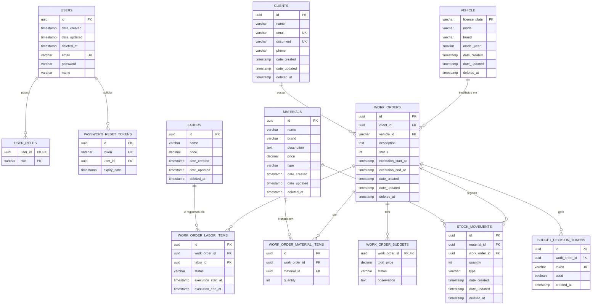

# ERD - Banco de Dados MecanicAdm

Diagrama de entidade-relacionamento.

```mermaid
erDiagram
    USERS ||--o{ USER_ROLES : "possui"
    USERS ||--o{ PASSWORD_RESET_TOKENS : "solicita"

    CLIENTS ||--o{ WORK_ORDERS : "possui"
    VEHICLE ||--o{ WORK_ORDERS : "é utilizado em"

    LABORS ||--o{ WORK_ORDER_LABOR_ITEMS : "é registrado em"
    MATERIALS ||--o{ WORK_ORDER_MATERIAL_ITEMS : "é usado em"
    MATERIALS ||--o{ STOCK_MOVEMENTS : "gera"

    WORK_ORDERS ||--o{ WORK_ORDER_LABOR_ITEMS : "tem"
    WORK_ORDERS ||--o{ WORK_ORDER_MATERIAL_ITEMS : "tem"
    WORK_ORDERS ||--o{ WORK_ORDER_BUDGETS : "tem"
    WORK_ORDERS ||--o{ STOCK_MOVEMENTS : "registra"
    WORK_ORDERS ||--o{ BUDGET_DECISION_TOKENS : "gera"

    USERS {
        uuid id PK
        timestamp date_created
        timestamp date_updated
        timestamp deleted_at
        varchar email UK
        varchar password
        varchar name
    }

    USER_ROLES {
        uuid user_id PK,FK
        varchar role PK
    }

    PASSWORD_RESET_TOKENS {
        uuid id PK
        varchar token UK
        uuid user_id FK
        timestamp expiry_date
    }

    VEHICLE {
        varchar license_plate PK
        varchar model
        varchar brand
        smallint model_year
        timestamp date_created
        timestamp date_updated
        timestamp deleted_at
    }

    CLIENTS {
        uuid id PK
        varchar name
        varchar email UK
        varchar document UK
        varchar phone
        timestamp date_created
        timestamp date_updated
        timestamp deleted_at
    }

    LABORS {
        uuid id PK
        varchar name
        decimal price
        timestamp date_created
        timestamp date_updated
        timestamp deleted_at
    }

    MATERIALS {
        uuid id PK
        varchar name
        varchar brand
        text description
        decimal price
        varchar type
        timestamp date_created
        timestamp date_updated
        timestamp deleted_at
    }

    WORK_ORDERS {
        uuid id PK
        uuid client_id FK
        varchar vehicle_id FK
        text description
        int status
        timestamp execution_start_at
        timestamp execution_end_at
        timestamp date_created
        timestamp date_updated
        timestamp deleted_at
    }

    WORK_ORDER_LABOR_ITEMS {
        uuid id PK
        uuid work_order_id FK
        uuid labor_id FK
        varchar status
        timestamp execution_start_at
        timestamp execution_end_at
    }

    WORK_ORDER_MATERIAL_ITEMS {
        uuid id PK
        uuid work_order_id FK
        uuid material_id FK
        int quantity
    }

    WORK_ORDER_BUDGETS {
        uuid work_order_id PK,FK
        decimal total_price
        varchar status
        text observation
    }

    STOCK_MOVEMENTS {
        uuid id PK
        uuid material_id FK
        uuid work_order_id FK
        int quantity
        varchar type
        timestamp date_created
        timestamp date_updated
        timestamp deleted_at
    }

    BUDGET_DECISION_TOKENS {
        uuid id PK
        uuid work_order_id FK
        varchar token UK
        boolean used
        timestamp created_at
    }
```